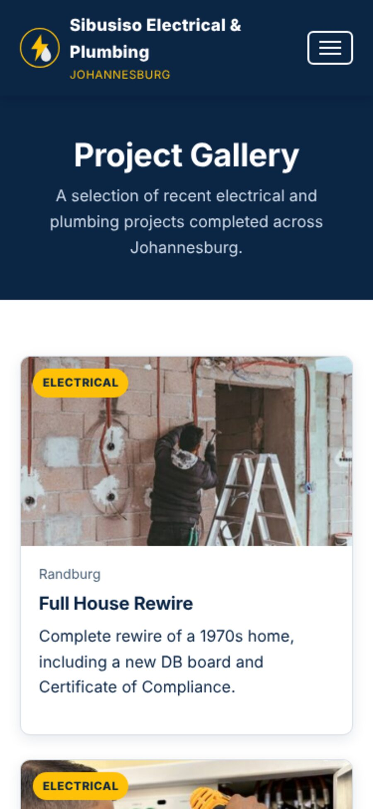
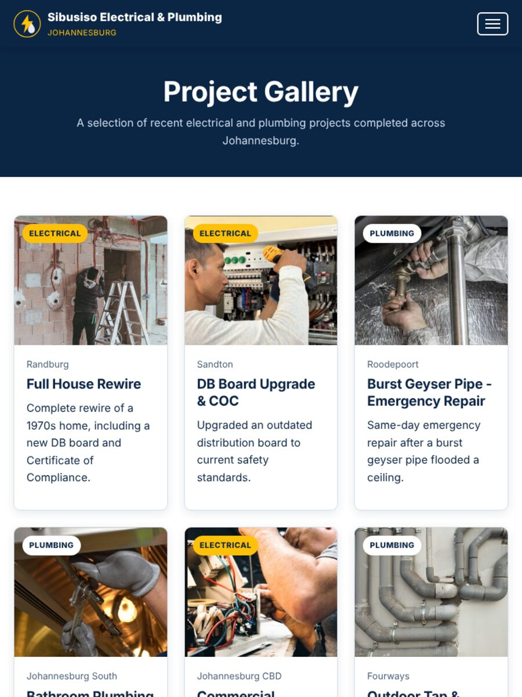
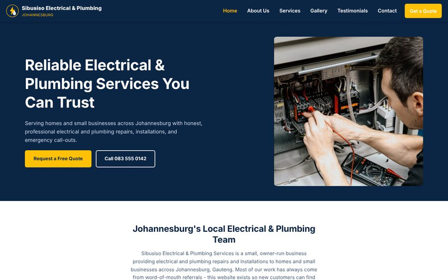
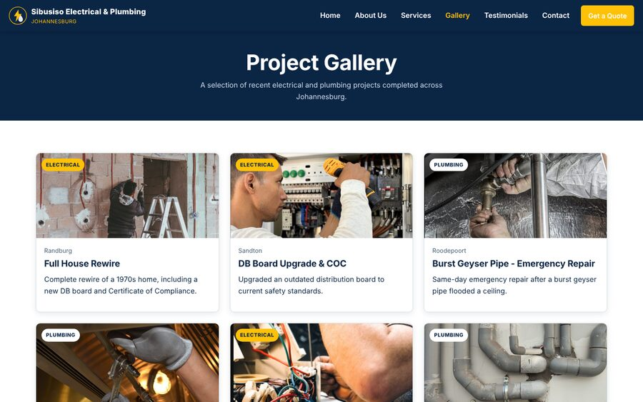
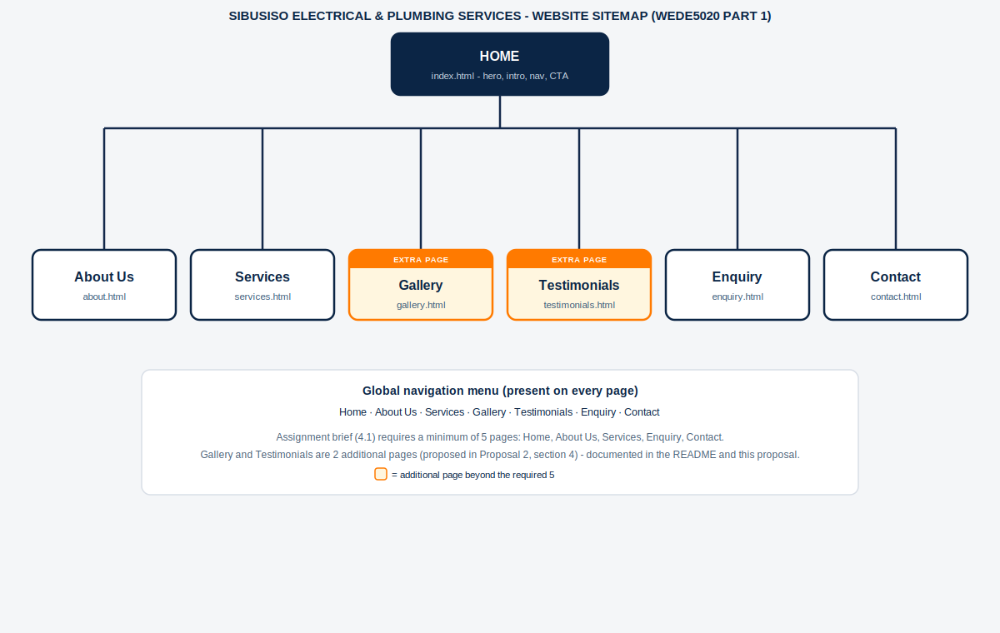

# Sibusiso Electrical & Plumbing Services - Website Project

**Module:** WEDE5020 | Website Project | Part 1 &amp; Part 2
**Chosen organisation:** Sibusiso Electrical & Plumbing Services (Proposal 2)

---

## Student Information

| Field | Detail |
|---|---|
| Student | Theolin Chetty |
| Student Number | ST10507916 |
| Module Code | WEDE5020 |
| Lecturer | Mr. J. Sookha |
| Submission | Part 1 (initial build) and Part 2 (CSS styling, responsive design, review) |

---

## Project Overview

Sibusiso Electrical & Plumbing Services is a small, owner-run business
providing electrical and plumbing repairs and installations to homes and
small businesses across Johannesburg, Gauteng. It is a **hypothetical
business created for this assignment**, modelled on real South African
sole-trader electrical/plumbing services (see the *Website Project
Proposal* document, Proposal 2, for the original brief this build is based
on).

Almost all of the business's work currently comes from word-of-mouth
referrals - the organisation has no dedicated website. This project builds
that first website: a central, mobile-friendly online presence that lets
new customers find the business, understand what it offers, and request a
quote or emergency call-out as easily as an existing customer can phone in.

This repository (Part 1) contains the initial site structure, all planned
HTML pages with real content, shared CSS/JS, and the supporting research
and planning documents.

---

## Website Goals and Objectives

- Build trust and make the business look established and professional online.
- Clearly explain electrical and plumbing services and the areas served.
- Generate quote requests and emergency call-out enquiries through a simple form.
- Place contact options (phone, WhatsApp, email, quote form) in highly visible locations on every page.
- Support mobile users, who may be searching for a tradesperson while away from a desktop computer.
- Use testimonials and a project gallery to reinforce credibility.

---

## Key Features and Functionality

- Responsive, mobile-first layout (CSS Grid + Flexbox, one shared stylesheet).
- Sticky header with a hamburger menu on mobile and a full horizontal menu on desktop (`js/script.js`).
- Homepage hero with a clear call to action ("Request a Free Quote" / click-to-call).
- Services page separating **Electrical**, **Plumbing**, and **Emergency Call-Out** offerings.
- Project **Gallery** with category-tagged project cards (additional page - see *Additional Pages* below).
- **Testimonials** page with star ratings and customer quotes (additional page - see below).
- **Enquiry** page with a validated quote/call-out request form (service type, suburb, preferred date, job description).
- **Contact** page with **two** physical locations (Johannesburg CBD head office + Randburg depot), each with its own embedded map, plus a general contact form.
- Client-side form validation with inline error messages and a success confirmation (no backend yet - see *Part 1 Details*).
- Semantic HTML5 (`header`, `nav`, `main`, `section`, `article`, `footer`) throughout, with code comments explaining each section.
- Photography for the hero, About page, team portraits, and all six Gallery cards, plus original SVG icons (logo, service icons) - see *Content Research and Sourcing*.

---

## Timeline and Milestones

*(Adapted from Proposal 2, section 7 "Timeline and Milestones".)*

| Week | Milestone |
|---|---|
| Week 1 | Client requirements, service inventory, sitemap, content plan, wireframes |
| Week 2 | Visual design and development of Home and Services pages |
| Week 3 | Gallery, Testimonials, Contact, quote form, responsive behaviour, content integration |
| Week 4 | Usability testing, accessibility checks, corrections, performance testing, client review, deployment |

---

## Part 1 Details

Part 1 covers:

1. **Content research and sourcing** - organisation research, written page
   copy, and image/icon assets, organised in `../02-Content-Research/`
   (images, documents, text subfolders per page).
2. **Website structure and planning** - sitemap (see below) and the file/
   folder structure required by the brief.
3. **HTML structure and basic content** - all pages built with semantic
   HTML5, integrated content, working navigation, comments, and consistent
   indentation.
4. **Testing and debugging** - pages were run through HTML-Tidy validation
   and visually tested at mobile (375px), tablet (700px), and desktop
   (1280px) widths; the mobile nav toggle and both forms (Enquiry, Contact)
   were interaction-tested (see *Changelog*).

*Part 3 (further functionality, refinement, and deployment) will follow in
a future submission/edit, per the assignment brief.*

### Additional Pages (beyond the required minimum of 5)

The brief requires a **minimum of 5 pages**: Home, About Us, Services,
Enquiry, Contact. This build includes **7 pages** - the 5 required pages,
plus two extra pages proposed directly in Proposal 2, section 4:

- `gallery.html` - before/after style project cards ("before-and-after
  project photographs" in Proposal 2).
- `testimonials.html` - customer reviews ("testimonials... to reinforce
  credibility" in Proposal 2).

Both are linked from the main navigation and the footer on every page.

### Images and Content Sourcing Note

Per the assignment brief, section 3.1, the site uses royalty-free
photography for the hero image, the About page story image, the three
team portraits, and all six Gallery project cards (11 photos in total).
This sandbox's network could not reach stock-photo CDNs directly, so the
photos were supplied by the student and converted/placed into the site
structure. Keep a record of each photo's exact source URL and licence
(e.g. Pexels License) for the Harvard reference list, since that detail
isn't recoverable from the image file itself.

The small circular icons throughout the site (electrical bolt, plumbing
drop, phone, clock, shield, etc.) and the logo remain original, hand-built
SVG graphics in the site's navy/white/safety-yellow theme - original
content is explicitly permitted by the brief, and icons are conventionally
illustrated rather than photographed.

---

## Part 2 Details

No formal lecturer feedback on Part 1 had been released at the time of this
submission, so Part 2 instead consists of a self-directed review of the
Part 1 build against the Part 2 brief, plus the new work the brief
requires. Part 1 already included a linked external stylesheet
(`css/style.css`), a mobile-first base/reset, and two responsive
breakpoints (700px tablet, 960px desktop), so Part 2 extends and hardens
that foundation rather than starting over. See the *Changelog* below for
the full, dated list of what changed and why.

1. **CSS styling for desktop.** Added a `rem`-based, fluid type scale
   (`clamp()` on headings so they scale smoothly between breakpoints
   instead of jumping), hardened the CSS reset (margin reset on headings,
   form-element font inheritance, `prefers-reduced-motion` support), and
   added `:active` pressed-states alongside the existing `:hover` /
   `:focus-visible` states on all buttons, nav links, footer links and
   card links.
2. **Responsive design.** Added a third, large-desktop breakpoint
   (`min-width: 1200px`) that widens the container and trust-highlights
   grid and enlarges the hero photo on big monitors, on top of the
   existing 700px/960px breakpoints. Added `srcset`/`sizes` responsive
   images (two or three resolutions per photo) to the hero photo, the
   About page story photo, and all six Gallery photos, so phones download
   a smaller file than desktop screens. Added a global `:focus-visible`
   outline as an accessibility fallback (WCAG 2.2 SC 2.4.7).
3. **Testing.** Re-tested all seven pages at mobile (375px), tablet
   (768px), desktop (1440px) and large-desktop (1920px) widths using
   Playwright (headless Chromium) after the CSS/HTML changes, to confirm
   nothing regressed. Screenshot evidence below.
4. **GitHub repository.** Repository pushed with descriptive commit
   messages; this README's Changelog and References sections updated for
   Part 2 (see below).

### Screenshot Evidence (Part 2)

Homepage and Gallery page at the three key breakpoints identified for this
site (mobile, tablet, desktop). All screenshots were captured from the
live pages in this repository using Playwright/Chromium.

**Mobile (375px)**

| Home | Gallery |
|---|---|
|  |  |

**Tablet (768px)**

| Home | Gallery |
|---|---|
|  |  |

**Desktop (1440px)**

| Home | Gallery |
|---|---|
|  |  |

At mobile widths the trust-highlights grid, service cards and gallery
cards all collapse to a single column and the hamburger menu replaces the
horizontal nav. At tablet width (>=700px) those grids move to two or three
columns and the horizontal nav returns at >=960px. At desktop and large-
desktop widths (>=1200px) the container widens further and the hero photo
grows, per the Part 2 breakpoint described above.

---

## Sitemap



```
Home (index.html)
 ├── About Us (about.html)
 ├── Services (services.html)
 ├── Gallery (gallery.html)            *additional page
 ├── Testimonials (testimonials.html)  *additional page
 ├── Enquiry (enquiry.html)
 └── Contact (contact.html)
```

The global navigation menu (Home · About Us · Services · Gallery ·
Testimonials · Enquiry · Contact) appears identically on every page, so any
page is reachable in a single click from anywhere on the site.

---

## File and Folder Structure

```
03-Website/                 <- website root (this folder)
├── index.html
├── about.html
├── services.html
├── gallery.html            (additional page)
├── testimonials.html       (additional page)
├── enquiry.html
├── contact.html
├── README.md
├── css/
│   └── style.css
├── js/
│   └── script.js
├── docs/                   (added in Part 2)
│   └── screenshots/        <- mobile/tablet/desktop evidence embedded above
│       ├── index-mobile.jpg, index-tablet.jpg, index-desktop.jpg
│       └── gallery-mobile.jpg, gallery-tablet.jpg, gallery-desktop.jpg
└── images/
    ├── logo.svg (icon only)
    ├── icon-*.svg (electrical, plumbing, emergency, quote, location, phone, clock, shield, cash)
    ├── hero-photo.jpg, about-story-photo.jpg (photography)
    ├── hero-photo-320w.jpg, about-story-photo-320w.jpg (added in Part 2, srcset variants)
    ├── team-sibusiso-nkosi.jpg, team-precious-dlamini.jpg, team-kabelo-mahlangu.jpg (photography)
    ├── gallery-full-house-rewire.jpg, gallery-db-board-upgrade.jpg,
    │   gallery-burst-geyser-repair.jpg, gallery-bathroom-renovation.jpg,
    │   gallery-commercial-maintenance.jpg, gallery-outdoor-tap-irrigation.jpg (photography)
    ├── gallery-*-400w.jpg, gallery-*-800w.jpg (added in Part 2, srcset variants)
    └── sitemap-diagram.png
```

A companion folder outside the website root, `02-Content-Research/`,
holds the source research: `images/` (organised per page), `documents/`
(sitemap source files), and `text/` (page-by-page content notes with
sources), as required by section 3 of the brief. The `01-Proposal-Document/`
folder holds the Website Project Proposal Word document (section 7.1).

---

## Changelog

| Date | Change |
|---|---|
| 2026-09-01 | Initial Part 1 build: project folder structure, content research, sitemap diagram, all 7 HTML pages, shared CSS/JS, README, and Website Project Proposal document created. |
| 2026-09-01 | Removed em dashes across all files. Replaced the hero image, About page story image, three team portraits, and all six Gallery project images with real photography (11 photos total), supplied by the student; icons and logo remain original SVG graphics. |
| 2026-10-05 | **Part 2 - Typography scale:** added `rem`-based CSS custom properties (`--fs-sm` through `--fs-2xl`) using `clamp()` for fluid headings, replaced the hardcoded `font-size` values on `.section-heading h2`, `.hero-copy h1` and the card heading group with the new scale variables, and set an explicit `html { font-size: 100%; }` base so all `rem` values resolve predictably. Added `letter-spacing` to headings. |
| 2026-10-05 | **Part 2 - CSS reset hardened:** extended the reset to zero out default margins on `h1-h4`/`p`/`figure`/`blockquote`/`dl`, made form elements (`input`, `button`, `textarea`, `select`) inherit font styling instead of using browser defaults, added an `ol` rule alongside the existing `ul` reset, and added a `prefers-reduced-motion` media query so `scroll-behavior: smooth` and CSS transitions are disabled for visitors who have that OS setting on. |
| 2026-10-05 | **Part 2 - Interactive states:** added `:active` "pressed" states (distinct from `:hover`/`:focus-visible`) to `.btn` and all three button variants, `.main-nav a`, `.footer-grid a`, and `.card-link`, plus a global `:focus-visible` outline as a fallback so every focusable element has a visible keyboard-focus indicator (WCAG 2.2 SC 2.4.7). |
| 2026-10-05 | **Part 2 - Large-desktop breakpoint:** added a third responsive breakpoint (`min-width: 1200px`) widening `--container-width` to 1320px, the trust-highlights grid gap, the hero photo height, and section padding, on top of the existing 700px (tablet) and 960px (desktop) breakpoints from Part 1. |
| 2026-10-05 | **Part 2 - Responsive images:** generated 320w/400w/800w resized JPEG variants (ImageMagick) for the hero photo, the About page story photo, and all six Gallery photos, and added `srcset`/`sizes` attributes to each `` so phones request a smaller file than desktop screens, per the brief's `srcset`/`sizes` requirement. |
| 2026-10-05 | **Part 2 - Testing and screenshot evidence:** re-tested all 7 pages at mobile (375px), tablet (768px), desktop (1440px) and large-desktop (1920px) widths using Playwright/headless Chromium after the above changes; added Home and Gallery page screenshots at mobile/tablet/desktop widths to the `docs/screenshots/` folder and embedded them in this README under *Part 2 Details*. |
| 2026-10-05 | **Part 2 - Documentation:** updated this README (Part 2 Details section, this changelog, and the reference list below) to cover the Part 2 submission. No formal Part 1 lecturer feedback had been released at submission time, so no specific corrections from a rubric are logged here; this pass was a self-directed review against the Part 2 brief instead. |

---

## References (Harvard Style)

*(Reused from the original WEDE5020 Part 1 "Target Organisation Proposals"
document - Theolin Chetty, ST10507916, 29 August 2026 - since these same
web standards govern the HTML/CSS/JS build in this repository.)*

MDN Web Docs (2025) *Responsive web design*. Available at: https://developer.mozilla.org/en-US/docs/Learn_web_development/Core/CSS_layout/Responsive_Design (Accessed: 29 August 2026).

Nielsen Norman Group (2024) *10 usability heuristics for user interface design*. Available at: https://www.nngroup.com/articles/ten-usability-heuristics/ (Accessed: 29 August 2026).

WHATWG (2026) *HTML Living Standard*. Available at: https://html.spec.whatwg.org/ (Accessed: 29 August 2026).

World Wide Web Consortium (W3C) (2024) *Web Content Accessibility Guidelines (WCAG) 2.2*. Available at: https://www.w3.org/TR/WCAG22/ (Accessed: 24 August 2026).

World Wide Web Consortium (W3C) (2024) *Understanding WCAG 2.2*. Available at: https://www.w3.org/WAI/WCAG22/Understanding/ (Accessed: 26 August 2026).

World Wide Web Consortium (W3C) (2024) *ARIA Authoring Practices Guide*. Available at: https://www.w3.org/WAI/ARIA/apg/ (Accessed: 25 August 2026).

Google for Developers (2025) *SEO Starter Guide*. Available at: https://developers.google.com/search/docs/fundamentals/seo-starter-guide (Accessed: 23 August 2026).

Mozilla Developer Network (MDN) Web Docs (2025) *CSS: Cascading Style Sheets*. Available at: https://developer.mozilla.org/en-US/docs/Web/CSS (Accessed: 24 August 2026).

OpenStreetMap Contributors (2026) *OpenStreetMap embeddable map*. Available at: https://www.openstreetmap.org/export/embed.html (Accessed: 1 September 2026). - *used for the two location maps on contact.html.*

MDN Web Docs (2025) *Responsive images*. Available at: https://developer.mozilla.org/en-US/docs/Web/HTML/Guides/Responsive_images (Accessed: 5 October 2026). - *used for the `srcset`/`sizes` implementation added in Part 2.*

MDN Web Docs (2025) *Using CSS custom properties (variables)*. Available at: https://developer.mozilla.org/en-US/docs/Web/CSS/CSS_cascading_variables/Using_CSS_custom_properties (Accessed: 5 October 2026). - *used for the Part 2 typography scale.*

MDN Web Docs (2025) *CSS clamp() function*. Available at: https://developer.mozilla.org/en-US/docs/Web/CSS/clamp (Accessed: 5 October 2026). - *used for the fluid heading sizes added in Part 2.*

MDN Web Docs (2025) *:focus-visible pseudo-class*. Available at: https://developer.mozilla.org/en-US/docs/Web/CSS/:focus-visible (Accessed: 5 October 2026). - *used for the global keyboard-focus outline added in Part 2.*

World Wide Web Consortium (W3C) (2023) *prefers-reduced-motion media feature*. Available at: https://www.w3.org/TR/mediaqueries-5/#prefers-reduced-motion (Accessed: 5 October 2026). - *used for the reduced-motion support added in Part 2.*
